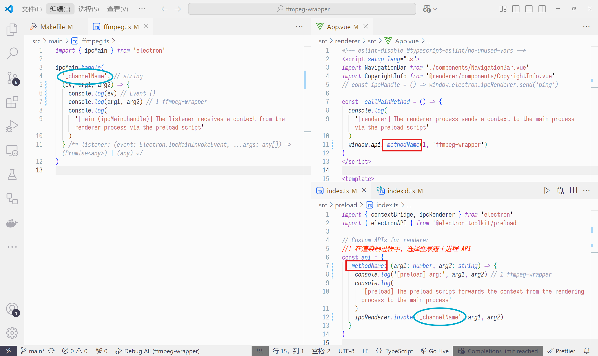

# fw

> [!note] fw
> 
> fw: ffmpeg wrapper

## 视频转码

### Create

```bash
# electron, vite, electron-vite, vue3
npm create @quick-start/electron

# ffmpeg
npm install --save @ffmpeg-installer/ffmpeg
npm install --save @ffprobe-installer/ffprobe
npm install fluent-ffmpeg
npm i @types/fluent-ffmpeg -D
```

### Install

```bash
npm install
```

### Development

```bash
npm run dev
```

### Build

```bash
# For windows
npm run build:win
# For macOS
npm run build:mac
# For Linux
npm run build:linux
```

## 项目架构

- main Node.js 主进程, 负责创建和管理浏览器窗口, 与操作系统交互, 文件 IO, 网络 IO
- preload
  - 预加载脚本包含在渲染器进程中执行的代码，该代码在网页内容加载前执行
  - 预加载脚本在渲染器进程中执行，但可以访问 Node.js API
  - 实现了主进程和渲染器进程间的隔离, 在渲染器进程中, 选择性暴露主进程 API
- renderer 渲染器进程, 负责渲染 HTML, CSS, JavaScript, 渲染网页, 处理用户交互事件



## 渲染器进程技术栈

- [electron](https://www.electronjs.org/zh/docs/latest/tutorial/quick-start)
- [vite](https://cn.vite.dev/guide/)
- [electron-vite](https://cn.electron-vite.org/guide/)
- [vue3](https://cn.vuejs.org/guide/introduction.html)
- [tailwindcss](https://www.tailwindcss.cn/docs/guides/vite#vue)
- [icon-park](https://iconpark.oceanengine.com/official)
- [element-plus](https://element-plus.org/zh-CN/guide/quickstart.html)
- [vue-router@4](https://router.vuejs.org/zh/guide/)
- [pinia](https://pinia.vuejs.org/zh/getting-started.html)

## 集成 tailwindcss

step0

```bash
# tailwindcss
npm install -D tailwindcss@3.4.17 postcss autoprefixer
npx tailwindcss init -p # 将创建 postcss.config.js, tailwind.config.js
```

- step1 [tailwindcss.sass](./src/renderer/src/assets/tailwind.scss) 文件名任意
- step2 [main.ts](./src/renderer/src/main.ts) 中副作用导入 [tailwindcss.sass](./src/renderer/src/assets/tailwind.scss)

[tailwind.sass](./src/renderer/src/assets/tailwind.scss)

```scss
@tailwind base;
@tailwind components;
@tailwind utilities;
```

[tailwind.config.js](./tailwind.config.js)

```js
/** @type {import('tailwindcss').Config} */
module.exports = {
  content: ['./index.html', './src/**/*.{vue,js,ts,jsx,tsx}'],
  theme: {
    extend: {},
    fontFamily: {
      sans: ['Yuanti SC', 'YouYuan'],
      serif: ['Yuanti SC', 'YouYuan'],
      mono: ['Menlo', 'Cascadia Code', 'monospace']
    }
  },
  plugins: []
}
```
